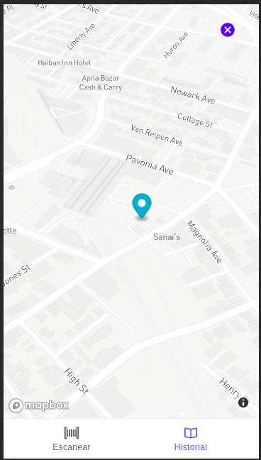
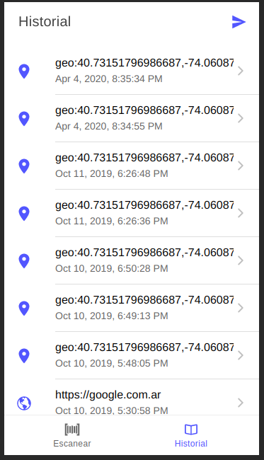

# Qr Scanner (Ionic)

This app scans a QR code and opens the web page or the map geolocation.

- Use a plugin for the scanner.
- Use a plugin for send emails with data.
- Use MapBox.

#### Map page


#### Details page



# Install

## Install the Ionic CLI

You need to have Ionic CLI in your system. You can see how to install it in **https://ionicframework.com/docs/intro/cli#install-the-ionic-cli**


## Install dependencies

You need to install all the dependencies on the project.

For install you need to run:

```
$ npm install
```


# Run the App

The majority of Ionic app development can be spent right in the browser using the ionic serve command:

```
$ ionic serve
```

**Note**: This app requires a camera, you need to run this on a Movile. Isn't prepare to PWA.


# API

The MapBox are getting from **https://www.mapbox.com/**

